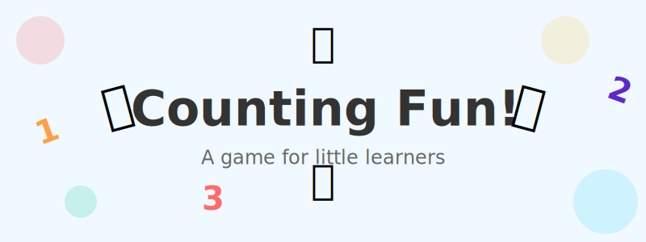

# Counting Fun! 🍎🚗🐶

A simple, colorful web game designed for toddlers to practice counting and number recognition.

The game flashes a random number of fun emojis (like apples, cars, or puppies), and the player simply clicks the matching number button. It's designed to be frustration-free with bouncy animations and positive feedback.

## Features

*   **Toddler-Friendly UI:** Large, easy-to-tap buttons and high-contrast colors.
*   **Adjustable Difficulty:** Start with numbers 1-3 and scale up to 20 as they learn.
*   **Engaging Feedback:** Confetti celebrations for correct answers and gentle "shake" animations for incorrect ones.
*   **Responsive:** Works great on tablets and desktops.

## How to Play

1.  Look at the screen to see how many items appear.
2.  Click the button with the matching number.
3.  Celebrate with confetti! 🎉

You can change the maximum number (from 1 up to 20) using the subtle selector in the bottom-left corner.

## Development

This is a lightweight, zero-dependency project built with vanilla **HTML**, **CSS**, and **JavaScript**.

### Running Locally

Since it's a single-file application, you can simply open `index.html` in any web browser. 

Alternatively, if you want to serve it using a local server (e.g., using Python):

```bash
python3 -m http.server
```

Then visit `http://localhost:8000`.

### Deployment

The game is hosted on **GitHub Pages**. Simply push changes to the `main` branch, and GitHub will automatically update the live site.

---
*Created with ❤️ for little learners.*
